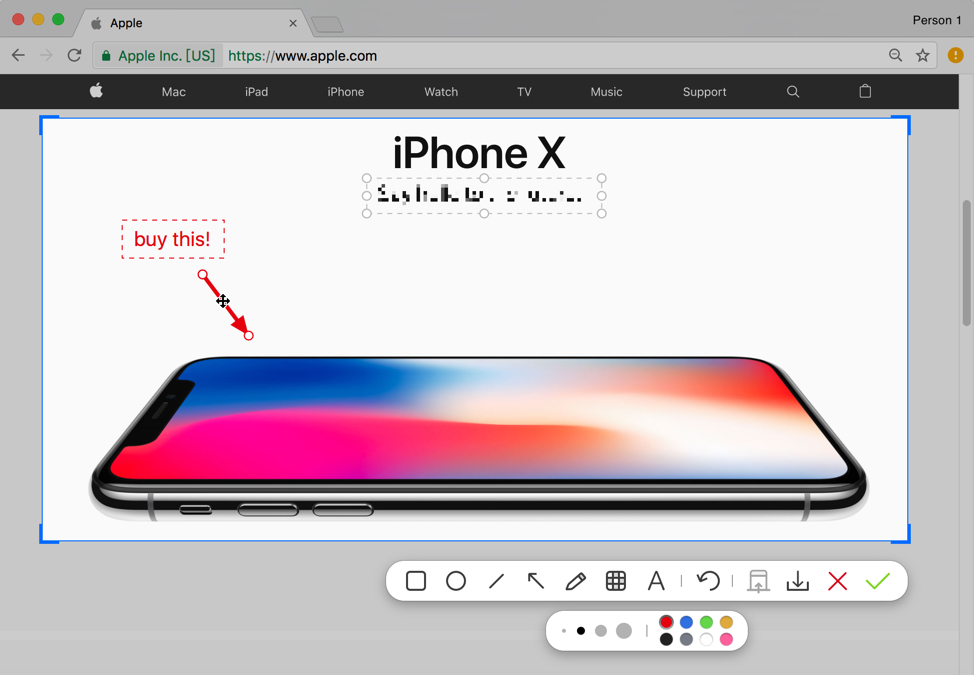

## U盘烧录
### 1. balenaEtcher
balenaEtcher是一款支持全平台（windows, macos, linux）的U盘烧录工具。


### 2. Rufus
Rufus只支持windows。但也是开源的。


## 电子书阅读
### 1. Calibre
Calibre是一款全平台，多功能的电子书工具，包括电子书格式转换，制作电子书，电子书编辑，当然也包括电子书阅读。


### 2. Foliate
Foliate只支持linux系统。


## 效率工具
### 1. Hammerspoon
Hammerspoon是一款mac上的自动化工具，支持写脚本实现功能。目前我使用它写脚本来实现窗口管理，其实它的功能远不止于此，还有更多酷炫的玩法等你去发现。
有兴趣的可以去官网看看。[http://hammerspoon.org](http://hammerspoon.org)

### 2. Mos
Mos是mac上一款用于平滑过度鼠标滚轮的工具。

## 截图工具
### 1. shutter

shutter只支持linux系统。官网：[https://shutter-project.org/](https://shutter-project.org/)
shutter的强大之处在于，除了常规的截图，还支持滚动截图，和菜单截图。

ubuntu用户可以参考[这篇文章](https://www.linuxuprising.com/2018/10/shutter-removed-from-ubuntu-1810-and.html)进行安装。

```shell
sudo add-apt-repository ppa:linuxuprising/shutter
sudo apt-get update
sudo apt install shutter

# 支持网页截图
sudo apt install gnome-web-photo
```

### Flameshot火焰截图

Flameshot只支持linux。设计简单，但功能丰富的现代截图工具。

### xnip
xnip只支持mac。

xnip有免费版和专业版，免费版会有水印，但如果你不介意，完全可以用免费版。

