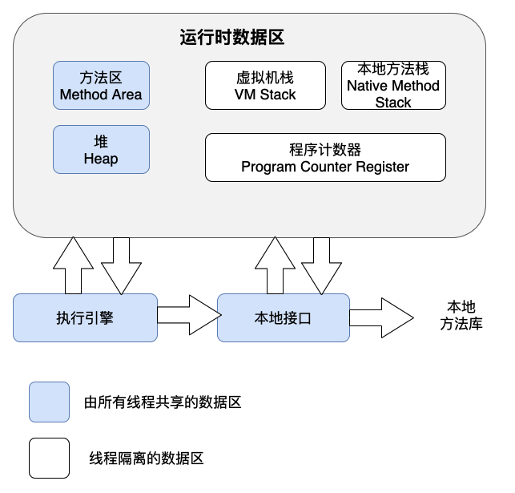
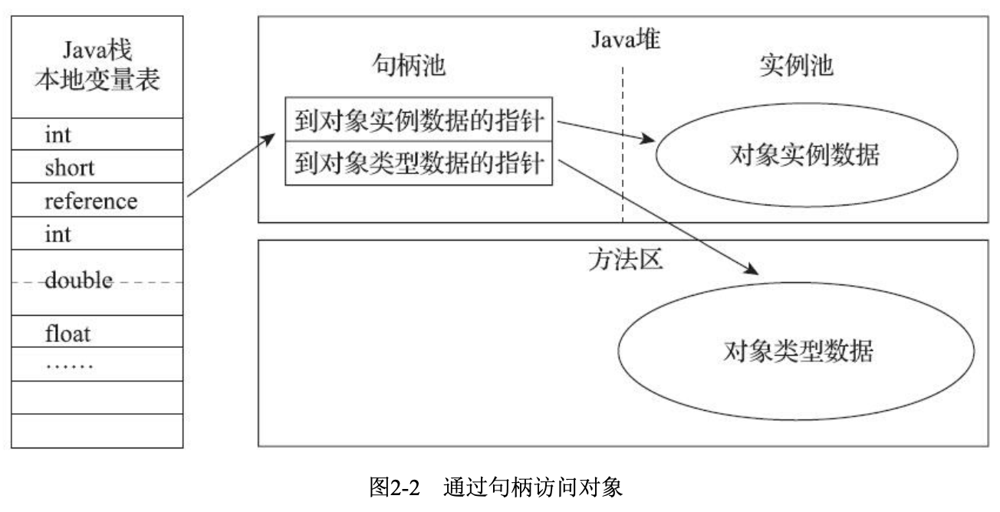
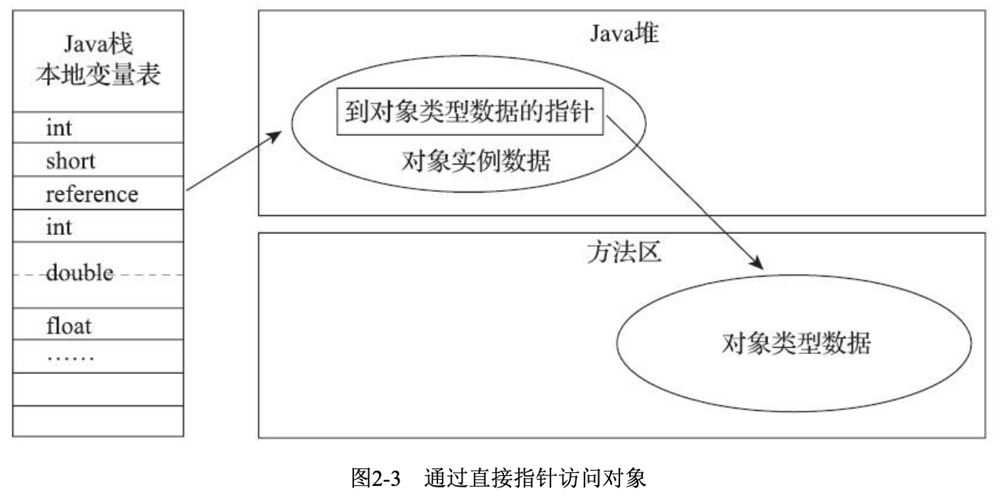

## 运行时数据区域

### 程序计数器
程序计数器是一块较小的内存空间，它可以看作是当前线程执行的字节码的行号指示器。在Java虚拟机的概念模型里[1]，字节码解释器工作时就是通过改变这个计数器 的值来选取下一条需要执行的字节码指令，它是程序控制流的指示器，分支、循环、跳转、异常处 理、线程恢复等基础功能都需要依赖这个计数器来完成。

由于Java虚拟机的多线程是通过线程轮流切换、分配处理器执行时间的方式来实现的，在任何一 个确定的时刻，一个处理器(对于多核处理器来说是一个内核)都只会执行一条线程中的指令。因 此，为了线程切换后能恢复到正确的执行位置，每条线程都需要有一个独立的程序计数器，各条线程 之间计数器互不影响，独立存储，我们称这类内存区域为“线程私有”的内存。

### Java虚拟机栈
与程序计数器一样，Java虚拟机栈(Java Virtual Machine Stack)也是线程私有的，它的生命周期与线程相同。虚拟机栈描述的是Java方法执行的线程内存模型:每个方法被执行的时候，Java虚拟机都 会同步创建一个栈帧[1](Stack Frame)用于存储**局部变量表**、**操作数栈**、**动态连接**、**方法出口**等信息。每一个方法被调用直至执行完毕的过程，就对应着一个栈帧在虚拟机栈中从入栈到出栈的过程。

局部变量表存放了编译期可知的各种Java虚拟机基本数据类型(boolean、byte、char、short、int、 float、long、double)、对象引用(reference类型，它并不等同于对象本身，可能是一个指向对象起始 地址的引用指针，也可能是指向一个代表对象的句柄或者其他与此对象相关的位置)和returnAddress 类型(指向了一条字节码指令的地址)。

在《Java虚拟机规范》中，对这个内存区域规定了两类异常状况:如果线程请求的栈深度大于虚 拟机所允许的深度，将抛出StackOverflowError异常;如果Java虚拟机栈容量可以动态扩展[2]，当栈扩展时无法申请到足够的内存会抛出OutOfMemoryError异常。

### 本地方法栈
本地方法栈(Native M ethod Stacks)与虚拟机栈所发挥的作用是非常相似的，其区别只是虚拟机 栈为虚拟机执行Java方法(也就是字节码)服务，而本地方法栈则是为虚拟机使用到的本地(Native) 方法服务。

《Java虚拟机规范》对本地方法栈中方法使用的语言、使用方式与数据结构并没有任何强制规 定，因此具体的虚拟机可以根据需要自由实现它，甚至有的Java虚拟机(譬如Hot-Spot虚拟机)直接 就把本地方法栈和虚拟机栈合二为一。与虚拟机栈一样，本地方法栈也会在栈深度溢出或者栈扩展失 败时分别抛出StackOverflowError和OutOfMemoryError异常。

### Java堆
对于Java应用程序来说，Java堆(Java Heap)是虚拟机所管理的内存中最大的一块。Java堆是被所 有线程共享的一块内存区域，在虚拟机启动时创建。此内存区域的唯一目的就是存放对象实例，Java 世界里“几乎”所有的对象实例都在这里分配内存。

Java堆是垃圾收集器管理的内存区域，因此一些资料中它也被称作“GC堆”。

如果从分配内存的角度看，所有线程共享的Java堆中可以划分出多个线程私有的分配缓冲区 (Thread Local Allocation Buffer，TLAB)，以提升对象分配时的效率。不过无论从什么角度，无论如 何划分，都不会改变Java堆中存储内容的共性，无论是哪个区域，存储的都只能是对象的实例，将Java 堆细分的目的只是为了更好地回收内存，或者更快地分配内存。

根据《Java虚拟机规范》的规定，Java堆可以处于物理上不连续的内存空间中，但在逻辑上它应该 被视为连续的，这点就像我们用磁盘空间去存储文件一样，并不要求每个文件都连续存放。但对于大 对象(典型的如数组对象)，多数虚拟机实现出于实现简单、存储高效的考虑，很可能会要求连续的 内存空间。

### 方法区
方法区(Method Area)与Java堆一样，是各个线程共享的内存区域，它用于存储已被虚拟机加载 的类型信息、常量、静态变量、即时编译器编译后的代码缓存等数据。

说到方法区，不得不提一下“永久代”这个概念，尤其是在JDK 8以前，许多Java程序员都习惯在 HotSpot虚拟机上开发、部署程序，很多人都更愿意把方法区称呼为“永久代”(Permanent Generation)，或将两者混为一谈。本质上这两者并不是等价的，因为仅仅是当时的HotSpot虚拟机设 计团队选择把收集器的分代设计扩展至方法区，或者说使用永久代来实现方法区而已，这样使得 HotSpot的垃圾收集器能够像管理Java堆一样管理这部分内存，省去专门为方法区编写内存管理代码的 工作。但是对于其他虚拟机实现，譬如BEA JRockit、IBM J9等来说，是不存在永久代的概念的。

《Java虚拟机规范》对方法区的约束是非常宽松的，除了和Java堆一样不需要连续的内存和可以选 择固定大小或者可扩展外，甚至还可以选择不实现垃圾收集。相对而言，垃圾收集行为在这个区域的 确是比较少出现的，但并非数据进入了方法区就如永久代的名字一样“永久”存在了。这区域的内存回 收目标主要是针对常量池的回收和对类型的卸载，一般来说这个区域的回收效果比较难令人满意，尤 其是类型的卸载，条件相当苛刻，但是这部分区域的回收有时又确实是必要的。

### 直接内存
直接内存(Direct Memory)并不是虚拟机运行时数据区的一部分，也不是《Java虚拟机规范》中 定义的内存区域。但是这部分内存也被频繁地使用，而且也可能导致OutOfMemoryError异常出现，所 以我们放到这里一起讲解。

在JDK 1.4中新加入了NIO(New Input/Output)类，引入了一种基于通道(Channel)与缓冲区 (Buffer)的I/O方式，它可以使用Native函数库直接分配堆外内存，然后通过一个存储在Java堆里面的 DirectByteBuffer对象作为这块内存的引用进行操作。这样能在一些场景中显著提高性能，因为避免了 在J ava堆和N at ive堆中来回复制数据。

显然，本机直接内存的分配不会受到Java堆大小的限制，但是，既然是内存，则肯定还是会受到 本机总内存(包括物理内存、SWAP分区或者分页文件)大小以及处理器寻址空间的限制，一般服务 器管理员配置虚拟机参数时，会根据实际内存去设置-Xmx等参数信息，但经常忽略掉直接内存，使得 各个内存区域总和大于物理内存限制(包括物理的和操作系统级的限制)，从而导致动态扩展时出现 OutOfMemoryError异常。

## HotSpot虚拟机对象探秘
### 对象的创建
当Java虚拟机遇到一条字节码new指令时，首先将去检查这个指令的参数是否能在常量池中定位到 一个类的符号引用，并且检查这个符号引用代表的类是否已被加载、解析和初始化过。如果没有，那 必须先执行相应的类加载过程，本书第7章将探讨这部分细节。

在类加载检查通过后，接下来虚拟机将为新生对象分配内存。对象所需内存的大小在类加载完成后便可完全确定(如何确定将在2.3.2节中介绍)，为对象分配空间的任务实际上便等同于把一块确定 大小的内存块从Java堆中划分出来。假设Java堆中内存是绝对规整的，所有被使用过的内存都被放在一边，空闲的内存被放在另一边，中间放着一个指针作为分界点的指示器，那所分配内存就仅仅是把那个指针向空闲空间方向挪动一段与对象大小相等的距离，这种分配方式称为“指针碰撞”(Bump The Pointer)。但如果Java堆中的内存并不是规整的，已被使用的内存和空闲的内存相互交错在一起，那就没有办法简单地进行指针碰撞了，虚拟机就必须维护一个列表，记录上哪些内存块是可用的，在分配的时候从列表中找到一块足够大的空间划分给对象实例，并更新列表上的记录，这种分配方式称为“空闲列表”(Free List)。选择哪种分配方式由Java堆是否规整决定，而Java堆是否规整又由所采用 的垃圾收集器是否带有空间压缩整理(Comp act)的能力决定。因此，当使用Serial、ParNew等带压缩 整理过程的收集器时，系统采用的分配算法是指针碰撞，既简单又高效;而当使用CM S这种基于清除(Sweep)算法的收集器时，理论上[1]就只能采用较为复杂的空闲列表来分配内存。

除如何划分可用空间之外，还有另外一个需要考虑的问题:对象创建在虚拟机中是非常频繁的行为，即使仅仅修改一个指针所指向的位置，在并发情况下也并不是线程安全的，可能出现正在给对象 A分配内存，指针还没来得及修改，对象B又同时使用了原来的指针来分配内存的情况。解决这个问题 有两种可选方案:一种是对分配内存空间的动作进行同步处理——实际上虚拟机是采用CAS配上失败 重试的方式保证更新操作的原子性;另外一种是把内存分配的动作按照线程划分在不同的空间之中进 行，即每个线程在Java堆中预先分配一小块内存，称为本地线程分配缓冲(Thread Local Allocation Buffer，TLAB)，哪个线程要分配内存，就在哪个线程的本地缓冲区中分配，只有本地缓冲区用完了，分配新的缓存区时才需要同步锁定。虚拟机是否使用TLAB，可以通过-XX:+/-UseTLAB参数来设定。

### 对象的内存布局
在HotSpot虚拟机里，对象在堆内存中的存储布局可以划分为三个部分:对象头(Header)、实例数据(Instance Data)和对齐填充(Padding)。

HotSpot虚拟机对象的对象头部分包括两类信息。第一类是用于存储对象自身的运行时数据，如哈 希码(HashCode)、GC分代年龄、锁状态标志、线程持有的锁、偏向线程ID、偏向时间戳等，这部 分数据的长度在32位和64位的虚拟机(未开启压缩指针)中分别为32个比特和64个比特，官方称它 为“Mark Word”。

对象头的另外一部分是类型指针，即对象指向它的类型元数据的指针，Java虚拟机通过这个指针 来确定该对象是哪个类的实例。

接下来实例数据部分是对象真正存储的有效信息，即我们在程序代码里面所定义的各种类型的字 段内容，无论是从父类继承下来的，还是在子类中定义的字段都必须记录起来。这部分的存储顺序会 受到虚拟机分配策略参数(-XX:FieldsAllocationSty le参数)和字段在Java源码中定义顺序的影响。 HotSpot虚拟机默认的分配顺序为longs/doubles、ints、shorts/chars、bytes/booleans、oops(Ordinary Object Pointers，OOPs)，从以上默认的分配策略中可以看到，相同宽度的字段总是被分配到一起存 放，在满足这个前提条件的情况下，在父类中定义的变量会出现在子类之前。如果HotSpot虚拟机的 +XX:CompactFields参数值为true(默认就为true)，那子类之中较窄的变量也允许插入父类变量的空 隙之中，以节省出一点点空间。

对象的第三部分是对齐填充，这并不是必然存在的，也没有特别的含义，它仅仅起着占位符的作 用。由于HotSpot虚拟机的自动内存管理系统要求对象起始地址必须是8字节的整数倍，换句话说就是 任何对象的大小都必须是8字节的整数倍。对象头部分已经被精心设计成正好是8字节的倍数(1倍或者 2倍)，因此，如果对象实例数据部分没有对齐的话，就需要通过对齐填充来补全。

### 对象的定位访问
创建对象自然是为了后续使用该对象，我们的Java程序会通过栈上的reference数据来操作堆上的具 体对象。由于reference类型在《Java虚拟机规范》里面只规定了它是一个指向对象的引用，并没有定义 这个引用应该通过什么方式去定位、访问到堆中对象的具体位置，所以对象访问方式也是由虚拟机实 现而定的，主流的访问方式主要有使用句柄和直接指针两种:
·如果使用句柄访问的话，Java堆中将可能会划分出一块内存来作为句柄池，reference中存储的就 是对象的句柄地址，而句柄中包含了对象实例数据与类型数据各自具体的地址信息，其结构如图2-2所示。

·如果使用直接指针访问的话，Java堆中对象的内存布局就必须考虑如何放置访问类型数据的相关 信息，reference中存储的直接就是对象地址，如果只是访问对象本身的话，就不需要多一次间接访问的开销，如图2-3所示。
